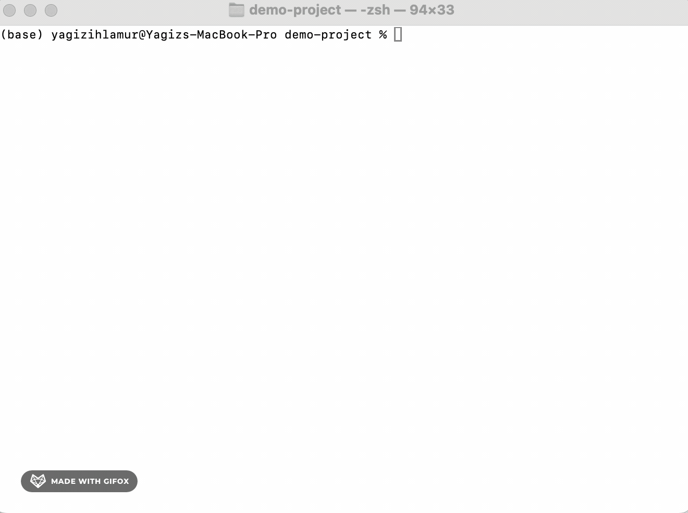

<h1 align="center">
  
  Vibe Check
</h1>

<p align="center">
  <strong>Design system observability for AI-native development</strong>
</p>

<p align="center">
  <a href="https://pypi.org/project/vibe-check/"></a>
  <a href="https://pypi.org/project/vibe-check/"></a>
  <a href="https://github.com/ihlamury/vibe-check/blob/main/LICENSE"></a>
  <a href="https://github.com/ihlamury/vibe-check/actions"></a>
</p>

<p align="center">
  <a href="#the-problem">Problem</a> •
  <a href="#the-solution">Solution</a> •
  <a href="#quick-start">Quick Start</a> •
  <a href="#features">Features</a> •
  <a href="#how-it-works">How It Works</a> •
  <a href="#roadmap">Roadmap</a>
</p>

---

<p align="center">
  
</p>

---

## The Problem

You're **vibe coding** with Cursor, Claude, or Copilot. Shipping fast. Feels great.

But by the 5th feature, your codebase looks like this:

```jsx
// File 1: p-4, rounded-lg, bg-blue-500
// File 2: p-3, rounded-xl, bg-[#3b82f6]
// File 3: p-5, rounded-md, bg-blue-600
// File 4: padding: 18px, border-radius: 10px, background: #2563eb
```

**No consistent spacing. Random colors. Mixed border radius. Design chaos.**

The AI doesn't know your design system. It just generates *something that works*.

---

## The Solution

**Vibe Check** scans your codebase, locks your design system, and teaches your AI tools to follow it.

```bash
# One command to rule them all
vibe init ./src
```

That's it. Your AI tools now understand your design system.

---

## Quick Start

### Install

```bash
pip install vibe-check
```

### Initialize

```bash
cd your-react-project
vibe init ./src
```

This will:
1. 🔍 Scan your codebase for design tokens
2. 🔒 Lock your design system to `.vibe/system.json`
3. 📝 Generate `.cursorrules` and `CLAUDE.md`
4. 🔌 Configure MCP server for Claude Desktop & Claude Code

### Check (anytime)

```bash
vibe check ./src
```

See what's drifting from your design system.

---

## Features

### 🔍 Design System Scanner

Extracts design tokens from your codebase:

| Category | What It Finds |
|----------|---------------|
| **Spacing** | `p-4`, `m-2`, `gap-6`, `px-[10px]` |
| **Colors** | `bg-blue-500`, `text-gray-900`, `bg-[#ff6b6b]` |
| **Typography** | `text-xl`, `font-bold`, `font-[Comic_Sans]` |
| **Border Radius** | `rounded-lg`, `rounded-[8px]` |
| **Shadows** | `shadow-md`, `shadow-[0_4px_6px_rgba(0,0,0,0.1)]` |

### 🚨 Issue Detection

Finds inconsistencies with clear severity levels:

```
🔴 ERRORS — Must fix
  1. colors: Replace arbitrary color `bg-[#ff6b6b]` with a theme color
  2. typography: Move `font-[Comic_Sans]` to tailwind.config.js

🟡 WARNINGS — Should fix
  1. border-radius: Reduce from 4 values to 2-3

🔵 SUGGESTIONS — Consider fixing
  1. colors: Consolidate 6 one-off colors (used only 1-2x)

Summary: 2 errors · 1 warning · 1 suggestion
```

### 🔒 Design System Lock

Generates `.vibe/system.json` — your source of truth:

```json
{
  "spacing": { "scale": [0, 2, 4, 6, 8, 12, 16] },
  "colors": [
    { "name": "primary", "value": "blue-500", "hex": "#3b82f6" },
    { "name": "neutral", "value": "gray-600" }
  ],
  "typography": {
    "font_sizes": ["sm", "base", "lg", "xl", "2xl"],
    "font_weights": ["normal", "medium", "bold"]
  },
  "border_radius": { "scale": ["md", "lg", "full"] },
  "shadows": { "scale": ["sm", "md", "lg"] }
}
```

### 🤖 AI Tool Integration

Works with all major AI coding tools:

| Tool | Integration | How |
|------|-------------|-----|
| **Cursor** | `.cursorrules` | Auto-read by Cursor |
| **Claude Code** | `CLAUDE.md` + MCP | Auto-read + live tools |
| **Claude Desktop** | MCP Server | Live design system queries |

### 🔌 MCP Server

Gives AI tools **live access** to your design system:

| Tool | Description |
|------|-------------|
| `get_design_system` | Returns full design system |
| `validate_styles` | Checks if styles are valid |
| `suggest_fix` | Suggests correct value for invalid style |

**Example conversation:**
```
You: Create a Card component
Claude: [uses get_design_system tool]
Claude: Here's a Card using your design system:
        - bg-white (from your palette)
        - p-4 (from your spacing scale)
        - rounded-lg (from your border radius)
        - shadow-md (from your shadows)
```

---

## How It Works

```
┌─────────────┐     ┌─────────────┐     ┌─────────────┐
│   Scanner   │ ──▶ │  Analyzer   │ ──▶ │    Lock     │
│             │     │             │     │             │
│ • Files     │     │ • Spacing   │     │ • JSON      │
│ • Tailwind  │     │ • Colors    │     │ • Rules     │
│ • CSS       │     │ • Typography│     │ • MCP       │
└─────────────┘     └─────────────┘     └─────────────┘
                                               │
                    ┌──────────────────────────┼──────────────────────────┐
                    │                          │                          │
                    ▼                          ▼                          ▼
            ┌─────────────┐            ┌─────────────┐            ┌─────────────┐
            │   Cursor    │            │ Claude Code │            │Claude Desktop│
            │ .cursorrules│            │  CLAUDE.md  │            │  MCP Server │
            └─────────────┘            │  MCP Server │            └─────────────┘
                                       └─────────────┘
```

---

## Commands

| Command | Description |
|---------|-------------|
| `vibe init [path]` | Full setup: scan → lock → configure AI tools |
| `vibe check [path]` | Scan for inconsistencies (CI/CD friendly) |
| `vibe lock [path]` | Lock design system to `.vibe/system.json` |
| `vibe serve` | Start MCP server (usually auto-started) |

### Options

```bash
vibe init ./src              # Full setup
vibe init ./src -y           # Skip prompts
vibe init ./src --skip-mcp   # Skip MCP configuration
vibe init ./src --skip-rules # Skip .cursorrules and CLAUDE.md

vibe check ./src             # Console output
vibe check ./src -v          # Verbose output
vibe check ./src -o json     # JSON output (for CI)
vibe check ./src -o markdown # Markdown output
```

---

## Supported Technologies

### Frameworks
- ✅ React / Next.js
- ✅ Vue / Nuxt
- ✅ Svelte / SvelteKit
- ✅ Plain HTML

### Styling
- ✅ Tailwind CSS (primary)
- ✅ Vanilla CSS
- ✅ SCSS

### AI Tools
- ✅ Cursor
- ✅ Claude Code
- ✅ Claude Desktop
- 🔜 GitHub Copilot
- 🔜 Windsurf

---

## Roadmap

### v1.0 (Current)
- [x] CLI scanner for Tailwind + CSS
- [x] Design system lock (`.vibe/system.json`)
- [x] Issue detection with severity levels
- [x] `.cursorrules` generation
- [x] `CLAUDE.md` generation
- [x] MCP server for Claude Desktop & Claude Code

### v1.1
- [ ] `tailwind.config.js` generation
- [ ] CSS variables output
- [ ] Ignore patterns (`.vibeignore`)
- [ ] Config file (`.vibeconfig.json`)

### v2.0
- [ ] GitHub Action for PR checks
- [ ] VS Code extension
- [ ] Web dashboard
- [ ] Team sharing

### v3.0
- [ ] Figma plugin (import design system)
- [ ] Design drift tracking over time
- [ ] Component usage analytics

---

## Contributing

Contributions welcome! Please read our [Contributing Guide](CONTRIBUTING.md) first.

```bash
# Setup development environment
git clone https://github.com/ihlamury/vibe-check.git
cd vibe-check
pip install -e ".[dev]"

# Run tests
pytest

# Run linter
ruff check .
```

---

## License

MIT © [Yagiz Ihlamur](https://github.com/ihlamury)

---

<p align="center">
  <strong>Stop the design drift. Start the vibe check.</strong>
</p>

<p align="center">
  <a href="https://github.com/ihlamury/vibe-check">⭐ Star on GitHub</a> •
  <a href="https://twitter.com/yagizihlamur">🐦 Follow on Twitter</a>
</p>
